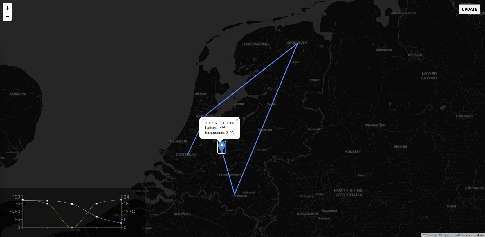

# Tiny Asset Tracker

## Disclaimer

Note that this sample IoT web application is for testing purposes only and not a secure solution for processing data.

## Description

Map to show tracked lora data for KPN IoT workshop

Runs an in-memory data store, so on restart the store will be reset and all recorded data will be lost.

Can be deployed to Azure Web App.

Runs on [Next.JS](https://nextjs.org)

## Running

1. install: `npm i`
2. build: `npm run build`
3. start server in production mode: `npm start`
4. (optional) seed with dummy data: `./postDummyData.sh`

Forward data from KPN Things to this app, running on localhost:

- KPN Things: set up a flow
- KPN Things: set destination HTTPS endpoint with https://webhook.site
- webhook.site (Tested in Firefox & Chrome, does NOT work in Safari): enable XHR Redirect
  - target: http://localhost:3000/api/lora
  - Content Type: application/json
  - HTTP Method: POST

Deploy on Azure:

- install azcli: `brew install azure-cli`
- log into Azure, where ??? is the tenant ID from Azure Active Directory: `az login --tenant ???`
- deploy: `az webapp up --sku B1 --location westeurope` (takes about 5 minutes)
- after deployment the URL is logged
- KPN Things: set destination HTTPS endpoint with `[generated URL]/api/lora`
- inspect logs: `az webapp log tail`
- open `[generated URL]` in the browser to see the web app

## Development

- `npm run dev`

## Docker

A Docker image is available at https://hub.docker.com/r/mdworld/tiny-asset-tracker 
To build it manually:

- build: `docker build -t mdworld/tiny-asset-tracker:1.0.0 .`
- run locally: `docker run --rm -p 3000:3000 --name tiny-asset-tracker mdworld/tiny-asset-tracker:1.0.0`
